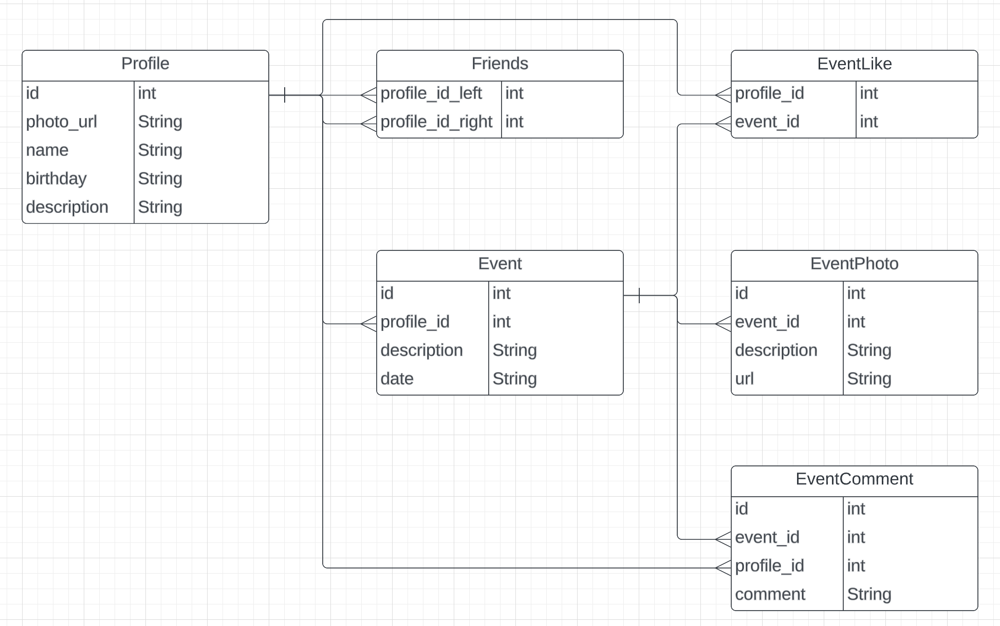
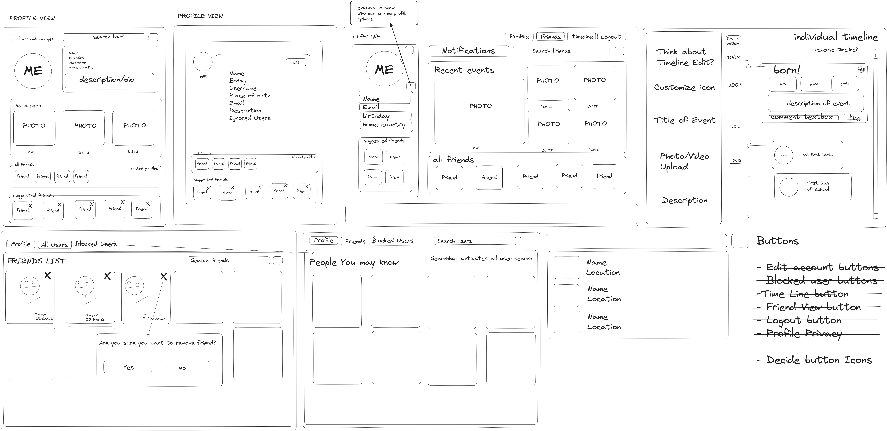

# Life Line

## Description

Users can chart their milestones or events on a timeline in chronological order. Users can view friends timelines and events and add likes and comments.

### User Story

```
AS A user
I WANT to create important events on a timeline
```

### Acceptance Criteria

```
GIVEN a functional CRUD (create, read, update and delete) application
WHEN I visit the homepage
THEN I can login or create an account to view my dashboard/profile
WHEN I visit my profile
THEN I can update my profile information
WHEN I visit my timeline
THEN I can add, update, or remove an event from my timeline
WHEN I visit my friends page
THEN I can view friends timelines and events, add friends, or ignore selected users
WHEN I view a friends event
THEN I can leave a comment or like the event
```

## Table of Contents

- [Installation](#installation)
- [Usage](#usage)
- [Credits](#credits)
- [License](#license)

## Installation

A step-by-step description of how to get the development environment running.

Use the following command to install the necessary packages

```
npm install (package_name@version)
```

This application uses the following:

### Front-end

[@popperjs/core](https://www.npmjs.com/package/@popperjs/core) given an element, such as a button, and a tooltip element describing it, Popper will automatically put the tooltip in the right place near the button

[bootstrap](https://www.npmjs.com/package/bootstrap) the most popular front-end framework for developing responsive, mobile first projects on the web

[bootstrap-icons](https://www.npmjs.com/package/bootstrap-icons) official open source SVG icon library for Bootstrap

[react-bootstrap](https://www.npmjs.com/package/react-bootstrap) Bootstrap 4 components built with React

[@emotion/react](https://www.npmjs.com/package/@emotion/react) simple styling in React

[@emotion/styled](https://www.npmjs.com/package/@emotion/styled) styled API for emotion

[@mui/icons-material](https://www.npmjs.com/package/@mui/icons-material) Material Design icons distributed as SVG React components

[@mui/lab](https://www.npmjs.com/package/@mui/lab) this package hosts the incubator components that are not yet ready to move to core

[@mui/material](https://www.npmjs.com/package/@mui/material) a comprehensive library of components that features implementation of Google's Material Design system

[@testing-library/jest-dom](https://www.npmjs.com/package/@testing-library/jest-dom) custom jest matchers to test the state of the DOM

[@testing-library/react](https://www.npmjs.com/package/@testing-library/react) a simple and complete React DOM testing utilities that encourage good testing practices

[@testing-library/user-event](https://www.npmjs.com/package/@testing-library/user-event) user-event tries to simulate the real events that would happen in the browser as the user interacts with it

[colord](https://www.npmjs.com/package/colord) a tiny yet powerful tool for high-performance color manipulations and conversions

[dotenv](https://www.npmjs.com/package/dotenv) to load environment variables from a .env file

[gh-pages](https://www.npmjs.com/package/gh-pages) publish to a gh-pages branch on GitHub (or any other branch on any other remote)

[react](https://www.npmjs.com/package/react) React is a JavaScript library for building user interfaces

[react-dom](https://www.npmjs.com/package/react-dom) React package for working with the DOM

[react-gallery-carousel](https://www.npmjs.com/package/react-gallery-carousel) mobile-friendly carousel includes: supporting touch, mouse emulation, lazy loading, thumbnails, full screen, RTL, keyboard navigation, and customizations

[react-router-dom](https://www.npmjs.com/package/react-router-dom) declarative routing for React web applications

[react-router-hash-link](https://www.npmjs.com/package/react-router-hash-link) Hash link scroll functionality for React Router

[react-scripts](https://www.npmjs.com/package/react-scripts) configuration and scripts for Create React App

[web-vitals](https://www.npmjs.com/package/web-vitals) easily measure performance metrics in JavaScript
<br />

### Back-end

[nodemon](https://www.npmjs.com/package/nodemon) nodemon is a tool that helps develop Node.js based applications by automatically restarting the node application when file changes in the directory are detected

[@aws-sdk/client-s3](https://www.npmjs.com/package/@aws-sdk/client-s3) AWS SDK for JavaScript S3 Client for Node.js, Browser and React Native

[bcrypt](https://www.npmjs.com/package/bcrypt) as a library to help you hash passwords

[connect-session-sequelize](https://www.npmjs.com/package/connect-session-sequelize) session store for connect-session using sequelize

[cors](https://www.npmjs.com/package/cors) CORS is a node.js package for providing a Connect / Express middleware that can be used to enable CORS with various options

[dotenv](https://www.npmjs.com/package/dotenv) to load environment variables from a .env file

[Express](https://www.npmjs.com/package/express/v/4.16.4) as a node js web application framework

[express-session](https://www.npmjs.com/package/express-session) is a simple session middleware for Express. Session data is not saved in the cookie itself, just the session ID. Session data is stored server-side

[jsonwebtoken](https://www.npmjs.com/package/jsonwebtoken) JSON Web Token implementation (symmetric and asymmetric)

[multer](https://www.npmjs.com/package/multer) middleware for handling multipart/form-data, which is primarily used for uploading files

[mysql2](https://www.npmjs.com/package/mysql2) to connect to your MySQL database

[sequelize](https://sequelize.org/docs/v6/) as a promise-based Node.js ORM tool for MySQL

[uuid](https://www.npmjs.com/package/uuid) for generating an Universal Unique Identifier
<br />

## Usage

To chart milestones or events on a timeline in chronological order. To view friends timelines and events and add likes and comments.

### Deployed Site

Front-end: https://life-line-home.netlify.app/
<br />
Back-end: https://life-line.herokuapp.com/
<br />

### ERD


### Wireframe


### Screenshot Desktop View


### Screenshot Tablet View


### Screenshot Mobile View


## Credits

Collaborators: Abi Kumagai, Taylor Orsini, and Tanya Silyutina

Tutor: Doug Kumagai:
<br />
https://www.linkedin.com/in/doug-kumagai/
<br />
https://github.com/ndesmic
<br />

mdn web docs: https://developer.mozilla.org/en-US/

Markdown License badges: https://gist.github.com/lukas-h/2a5d00690736b4c3a7ba

shields.io: https://shields.io/

Insomnia: https://insomnia.rest/

Event Listeners in React Components: https://www.pluralsight.com/guides/event-listeners-in-react-components

Building a Vertical Timeline With CSS and a Touch of JavaScript: https://codepen.io/tutsplus/pen/QNeJgR 
    - original timeline inspiration

Practical Use Cases for Scroll-Linked Animations in CSS with Scroll Timelines: https://css-tricks.com/practical-use-cases-for-scroll-linked-animations-in-css-with-scroll-timelines/

Timeline: https://mui.com/material-ui/react-timeline/ 
    - timeline displays a list of events in chronological order

Cloud Storage on AWS: https://aws.amazon.com/products/storage/ 
    - Reliable, scalable, and secure storage for your data

Amazon S3: https://aws.amazon.com/s3/?c=s&sec=srv
    - Amazon Simple Storage Service (Amazon S3) is an object storage service offering industry-leading scalability, data availability, security, and performance

Bootstrap docs: https://getbootstrap.com/

Favicon I/O: https://favicon.io/
    - favicon generator / converter

Image Online: https://crop-circle.imageonline.co/
    - crop a circle in image online


## License

Please refer to the LICENSE in the repo.

---

## Badges

[](https://opensource.org/licenses/MIT)
